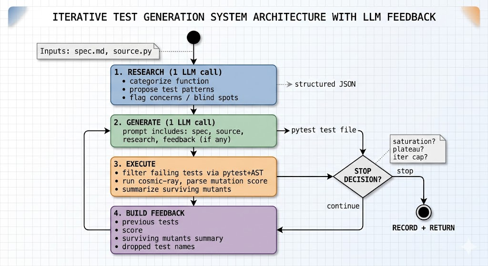

# Stem Agent for Test Quality: Specialized Test Generation vs Mutation Score
> JetBrains AI Engineering Internship - Stem Agent Project  

---

## 1. Introduction and Domain

It was a 7-day pins and needles story... Consecutive fails with debug to find even more fails.

Strangely enough, but summing up my work I can conclude - that I have implemented the same loop I was working in. The agent's pipeline is research => generate => fail => regenerate. My week was: research (domain) => decision branch => smoke test => fail => debug
Failing and succeding as myself, but always regenerating with feedback

This report will present 4-phase agent (research => generate => execute <=> feedback) that **improved mutation kill-rate by an avg of +11.7%** over single-shot LLM prompting on 11 functions, with 3 functions exceeding +20pp **at total API cost <~$0.10**

One of the hardest decisions was choosing a domain and scope. A stem agent doesn't only have
to be efficient and all-powerful => but also story-driven and showcasing. Initial sketch ideas included:

- **Multi-file vulnerability detection** - Recent ==Mythos Report== security check inspired. **Kill reason:** the underlying tool ecosystem is too strong to beat in 7 days. While dedicated tool CodeQL already exists, LLM-vs-CodeQL is a comparison the LLM loses.

- **Mellum-style context composition for code completion** - ==EnsembleAI== experience isnpired. The closest to JetBrains own tool **Kill reason:** completion benchmarks are noisy => evaluation is the single most important step, that could've eaten days with no rollback after failure.

- **Code quality review** - clean code is still relevant, right, Mr. Robert Martin? **Kill reason:** Code-quality => the highest scored benchmark in LLM comaprison (SWE-bench, MBPP)

- **MCP server management or migration tooling** - **Kill reason:** no clean ground truth

- **Test quality against mutants - winner** - **Synopsis:** Test coverage =/= Test Quality. **Win Reason:** Unambiguous metric (kill rate), Established tool (cosmic-ray), Published Reference Benchmark (Pynguin), JetBrains-adjacent. Truly showcasing for STEM concept => **"reads signals from its environment and transforms"**

The domain choice resolved most of the listed risks. The harder failures came from the implementation itself. However, by definition, picking the wrong domain would have been unrecoverable.

**Hypothesis:** After commiting 1 day to Research => valuable articles & repos & benchmarks I have found out that **Pynguin Generated vs Human-Written** were leaning towards **generated**, while **Pynguin vs Naive** has not so *one-sided showdown* with its nuances. But here generated is search algorithm that derives test cases from source code.
**Question?** *Can* STEM Agent (research, iteration, self-feedback, regeneration) produce measurably better tests on a fair benchmark?

## 2. Approach

### 2.1 Core problems

Before an actual implementation - I have identified 3 concrete risks:

**Memorization-as-generalization** - instead of asking "does the agent help", it should be whether LLM solving problem or pattern-matching to training data? gpt-4o-mini has seen tens of thousands of linked-list and BST test suites. Its "specialization" on those programs might be retrieval, not reasoning. **Solution:** I'll mention it furhter with examples, but I have implemented *handwritten benchmark* specifically to put pressure here. Functions written by myself with no particular business style, so pattern matching can fail. If the agent helps on those *and* on textbook code, it's reasoning. If it only helps on textbook code, it's retrieval.

**The "fancy prompt engineering" risk** - intially, this was a mentality problem => multi-phase agent thats just 3 prompts in a loop was shallow, not a research submission. I needed some *innovation* that would make STEM concept *measurably different* than a single-shot call could, even if the single-shot call had the same information density crammed into one prompt. **Solution:** Clear reproducible enviroment + artifacts. STEM Agent receives a sequential feedback & state rollback after each iteration => naive variance is wide and stem variance is tight

**Benchmark contamination** - wanted to pursue with synthetic function generation + using public code repos. Risking to make the naive baseline artificially strong because the agent training distribution and the test distribution would overlap **Solution:** Just abandon the idea + as above implement hand-written functions

### 2.2 Benchmark

Chosen **Hybrid** Approach: **(1)** Internal tier (handwritten) built - force genralization **(2)** External tier (textbook) from Cosmic Ray Benchmark

9 handwritten functions **(internal tier = pure logic, state machines, in-file dependencies)** & 6 textbook programs from `aurimrv/python_experiments` **(external tier = `linkedList1`, `binarySearchTree1`, `queue1`, `stack1`, `sort1`, `identifier1`)** 
Each function ships with `source.py`, `spec.md`, `meta.yaml`. Mutant counts range from 30 to 313 per function under cosmic-ray's default operator set with 60s timeout.

**Three sources of comparison evidence:** *repo-shipped human tests*, *naive LLM* (gpt-4o-mini, N=5, T=0), *Stem agent* (gpt-4o-mini, N=3, T=0). The naive baseline is the primary comparator => human and Pynguin numbers are external calibration only.

**Mid-experiment correction:** aurimrv published numbers required recomputation, as `cr-rate` reports survival, not kill rate

## 3. Methodology

### 3.1 Primary Metric

Mutation kill rate: `mutants_killed / mutants_total × 100`, computed directly from `cr-report` raw counts.

Additionally, **mean and standard deviation across runs** to ensure that results are statistically meaningful and not random. Mutation testing is noisy and single-run scores can be misleading.

### 3.2 Test filtering

During the first runs it was discovered that **LLM can sometimes hallucinate causing the entire test case to fail** (even prev successful ones) => so instead of discarding the whole output - implemented Filter Function to drop any ERROR fn by pytest. This does not disrupt the benchmark cause mutants can be killed only ON SUCCESSFUL RUN.

**Statistical Safety** => Log both `tests_generated` (raw LLM output) and `tests_kept` (passing subset)

### 3.3 External calibration: Pynguin baselines

For the textbook tier - `aurimrv/python_experiments` repo publishes mutation scores from Pynguin-generated test suites under several test-generation algorithms (DYNAMOSA, MOSA, MIO, RANDOM). These serve as a reference baseline for what *automated, non-LLM test generation* achieves on the same code with the same cosmic-ray operator set

**Note:** Not a primary comparison metric, because these tests were produced **by a search algorithm, not an LLM and with a different pipeline** But they interenstigly ==better than human-written ones== and ==not ulitmately better or worse than Agent (and vice versa, 4.1 Comparison + Notes)== => **proves further the value of STEM Concept**

### 3.4 Stem agent specifics

The agent runs **research => generate => execute <=> feedback => stopping** loop. Each phase is a separate function; state is passed between them as dataclasses.

**Research** - 1 LLM call that produces structured JSON: *function category, rationale, candidate test patterns & concerns flagging blind spots* a naive prompt would miss. **Temperature - 0** to ensure consistency.

**Generate** - 1 LLM call per iteration. **Prompt = Research + Feedback** Feedback block - main design choice. Initial implementations passed only a textual summary ("previous score was X, surviving mutators were Y") => which regressed scores because LLM rewrote tests from scratch, dropping working ones. The fix: **augment, don't replace** The prev test file is embedded and LLM is instructed to keep all existing tests and add new ones targeting surviving mutants.

**Execute** - runs *Test Filter* + cosmic-ray on the surviving test subset => parses the raw `cr-report` for total/killed counts, and summarizes surviving mutants by mutator type for the next iteration feedback.

**Stopping rules:**
| Condition | Threshold | Rationale |
|---|---|---|
| Saturation | mutation_score ≥ 95% | Already saturated |
| Plateau | iter ≥ 2 AND delta < 2% | Diminishing returns |
| Iteration cap | iter ≥ 3 | Time + Costs Cap |

**Example Output:** [specialization_record.yaml](./results/runs/20260427-141244/workdir/linkedList1_run0_1777291964096251600/specialization_record.yaml)
**Key Findings:** Mutation score => 39.04% => 42.47% => 43.84%. Stopped because of plateau at iter_3 with delta=1.37%

**File: [stem.py](./stem_agent/stem.py)**

Below is UML diagram for the suggested architecture of STEM Agent:


### 3.5 Scope Decisions

- N=3 runs for stem agent (vs N=5 for naive). **Reason:** Cost + Time Constraints. While 3 is still statistically safe for variance estimation, but it is less robust than 5.
- Functions with naive >85% (apply_discount, queue1, can_access_resource) skipped from stem run => saturation predicted. Reported with naive baseline only.
- Single domain (test quality) only. Wanted to pursue cross-domain transfer (e.g. security analysis) but time constraints prevented it. Future work.

## 4. Results

### 4.1 Comparison table

| Function | Pynguin | Human | Naive (mean ± std) | Stem (mean ± std) | delta vs naive |
|---|---|---|---|---|---|
| **Internal tier** | | | | | |
| validate_date | - | - | 54.7 <span style="color:red">± 30.9</span> | **88.7 ± 2.8** | **+34.0** |
| parse_log_line | - | - | 51.6 <span style="color:red">± 22.0</span> | **84.0 ± 10.1** | **+32.4** |
| transition_order_status | - | - | 62.9 ± 2.2 | **69.4 ± 0.0** | **+6.5** |
| is_future_date | - | - | 73.8 ± 0.8 | **77.7 ± 0.7** | **+4.0** |
| transition_account_state | - | - | 70.4 ± 1.3 | 72.7 ± 1.5 | +2.3 |
| check_permission | - | - | 78.2 ± 0.0 | 78.2 ± 0.0 | ±0.0 |
| parse_user_id_from_string | - | - | 66.7 ± 0.0 | 66.7 ± 0.0 | ±0.0 |
| apply_discount | - | - | 96.5 ± 0.8 | *skipped* (saturated) | - |
| can_access_resource | - | - | 88.9 ± 0.0 | *skipped* (saturated) | - |
| **External tier** | | | | | |
| identifier1 | 87.1 | 12.9 | 62.4 ± 36.3 | **85.0 ± 1.4** | **+22.6** |
| binarySearchTree1 | 80.1 | 27.5 | 46.2 ± 2.0 | 61.9 <span style="color:red">± 21.0</span> | **+15.8** |
| linkedList1 | 72.6 | 37.0 | 39.6 ± 1.5 | 48.6 ± 8.7 | **+9.0** |
| sort1 | 45.4 | 64.6 | 84.3 ± 0.0 | 86.8 ± 1.1 | +2.5 |
| queue1 | 100.0 | 100.0 | 100.0 ± 0.0 | *skipped* (saturated) | - |
| stack1 | 35.1 | 63.2 | 83.3 ± 0.0 | **94.4 ± 1.3** | **+11.1** |

**Interpretation:** 10 / 12 functions improved by >1% & 0 regressed & mean delta across the comparison set is **+11.7%**. Three functions improved by >20% (validate_date, parse_log_line, identifier1) - naive prompting was unstable to begin with (`22<std<36`)

**Pynguin vs STEM Agent:** The interesting part is that Stem **so much better at its wins over Pynguin (+59.3% on `stack1` and +41.4% on `sort1`)**, while losing on `linkedList1` and `binarySearchTree1` by **only 24.0% and 18.2%** respectively.
My hypothesis is that **Pynguin search-based approach is less effective on modular and complex functions with bracnhed logic and edge cases** => that should explain why algorithmic data-structure like `binarySearchTree1` and `linkedList1` are Pynguin's wins, while `sort1` and `stack1` => heavily depended on big O complexity and edge cases are Stem wins.

### 4.2 What the data shows

> **Pattern 1: Skipped Saturation Cases** - `check_permission` & `parse_user_id_from_string` were already at the ceiling => plateu stopping signal fires early + no headroom for specialization

> **Pattern 2: Specialization Reduces Variance** - `validate_date` & `parse_log_line` - means ~52% and **std ~22-31** Stem agent pushed both to 84-89% with std dropping to 3-10. *The variance reduction is itself a key finding* - naive run-2-run instability is the clearest sign that single-shot prompting under-specifies test design.

> **Pattern 3: Diminishing Stateful Gains** - `transition_account_state` & `transition_order_status` showed +2 to +7% State machines flow is easily predictable. Naive already captures most of it. Specialization adds boundary cases the naive prompter misses but doesn't transform the result.

### 4.3 Cost

**Practical Implication:** The cost is low *~$0.10* => Massive Specialization Gains at Negligible Cost => clear win for the approach

## 5. What surprised & failed me

### 5.1 Metric Inversion

* **Mid-experiment discovery:** cosmic-ray cr-rate reports survival => not kill rate. This invalidated several days of comparison data and required recomputation. **Lesson:** trust raw counts, not derived CLI outputs

### 5.2 Augment vs Replace

* **Changed Prompting Strategy:** Initial *"regenerate from feedback summary"* approach regressed scores because the LLM rewrote tests and dropped working ones. The fix: embed the previous test file verbatim and instruct "keep all, add new ones for surviving mutants" That decision has boosted the result scores massively **Lesson:** feedback-driven iteration on LLM output requires *additive* framing, not *corrective* framing

### 5.3 BST Divergence Run0 vs Run2

* **1st Run Determined Run:** `binarySearchTree1` muation_score range >= 40% (run0 = 85.78%, run2 = 45.97%) Looking at records => iter0 failure: 21 tests at 84.83% vs 18 tests at 34.60% => prompt strategy of *augment-dont-replace* couldnt recover so fast from fail. But still iter2 on run2 has gained >11% **Lesson:** temp=0 is not deterministic at the API level. error-propagation is still a massive risk which only compounds in STEM architecture. Should implement Best-of-N or adaptive early stopping to mitigate it

### 5.4 Implementation Failures

* **Spec Ambiguity:** `apply_discount` initially scored 0% during the pilot phase not because the tests were bad, but because the spec said **"raises ValueError on None" while the function raised TypeError** The LLM correctly followed the spec => the function disagreed with itself. **Lesson:**  The agent followed the spec, meanwhile spec contradicted the implementation. LLM-generated follows the drift between spec and implementation.

### 5.5 Bidirectional Variance

* **Variance reduction:** `parse_log_line` std=22; `validate_date` std=31 STEM reduced std=3-10. The iteration loop produces more consistent results and tests.

* **Variance amplification:** `binarySearchTree1` and `linkedList1` on contrary STEM increased std=21 from naive std=2. Variance behavior depends on whether iter0 is stable => if iter0 high- variance, iteration amplifies divergence **Lesson:** Where variance is already high, iteration can amplify it further. Where variance is low, iteration can reduce it.

### 5.6 Failures

- **Surviving-mutant Parser Bug** Early parser logic extracted the wrong field from cosmic-ray => feedback sometimes reported no survivors when many existed

- **Token Count Growth** No caching, diff-based prompt, context manupulation => prompt cost was ~700 tokens for research, ~1900 for iter_0 generation, and ~2200+ for iter_1+ with full tests.

## 6. What I'd do with more time

**Cross-domain validation** Intial idea but implementation of 1 domain was itself a load-bearing task. Example: CodeQL queries from natural-language descriptions. The strongest test of the stem-cell analogy.

**Per-mutant feedback rather than per-mutator-type** Embed actual mutated code snippets from top 3-5 survivors. The LLM would write directly against specific lines instead of categories.

**Soft Test Filter** Convert failed cases to soft warnings on first iteration => add them to context, which will allow the agent re-derive the solution. Closer to test-driven development than to generate-and-discard.

**Pynguin Internal Baseline** Running Pynguin on the Internal benchmark would give 3rd reference point on functions where search-based generation might struggle.

**Adaptive Early Stopping** Instead of fixed 2% for plateau threshold => Wilson confidence interval. Adapts to variance.

**Best-of-N initial generation** Run iter0 K times in parallel => pick the best baseline-coverage seed before iterating. Mitigates biddirectional variance.

## 7. Reproducibility

#### SETUP:
```bash
git clone https://github.com/HunterNopen/StemAgentJB
cd StemAgentJB
pip install -r requirements.txt
echo "OPENAI_API_KEY=sk-..." > .env
```

### Demo mode (DEFAULT and RECOMMENDED)
[static.py](./stem_agent/static.py) has var `IS_DEMO_MODE` When True => project will run both pipelines on `validate_date.py` with N=1, MAX_ITER=1. **ETA:** ~2-5 minutes for naive, ~5-10 minutes for stem. Verifies installation and creates artifacts in results/demos.

```bash
python -m stem_agent.naive    # output >>> results/runs/demos/naive_baseline.csv
python -m stem_agent.stem     # output >>> results/runs/demos/stem_baseline.csv
                              # specialization_record.yaml per function
```

#### Full benchmark

Set `IS_DEMO_MODE = False`. Approximate wall-clock and cost on `gpt-4o-mini`:

| Pipeline | Functions | Runs | Iterations | ETA | Cost |
|---|---|---|---|---|---|
| Naive baseline | 14 (9 internal + 5 textbook, stack1 dropped) | 5 | 1 | ~75 min | ~$0.05 |
| Stem agent | 11 (skipping naive >85%) | 3 | up to 3 | ~5 hours | ~$0.08 |

#### Repo Structure

```
stem_agent/         pipelines, prompts, dataclasses
benchmark/
    internal/           9 handwritten function benchmarks (source.py, spec.md, meta.yaml)
    external/           6 textbook programs from aurimrv/python_experiments
results/runs/       timestamp folders
docs/REPORT.md      => this document
```


#### Artifacts

- STEM representative artifacts => [results/runs/20260427-143243/](./results/runs/20260427-143243/stem_baseline.csv); Naive => [results/runs/20260426-235300/](./results/runs/20260426-235300/naive_baseline.csv)
- `cosmic-ray` numbers recomputed from raw `cr-report` counts
- STEM AGent calls LLM ~6 times per run (1 research + up to 3 iterations, each generation + embedded surviving-mutants summary). Token usage logged per-run in the `stem_baseline.csv` => `total_tokens_in` and `total_tokens_out` columns